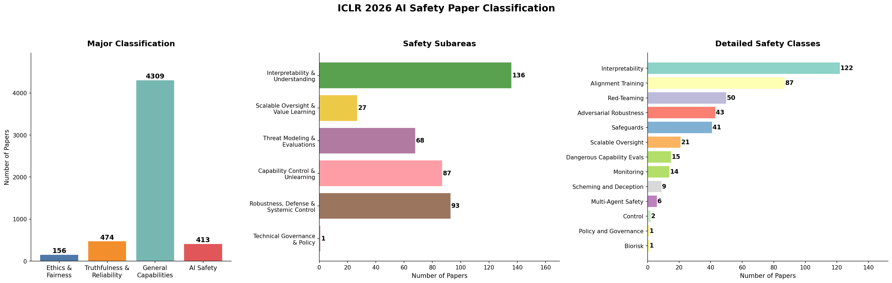
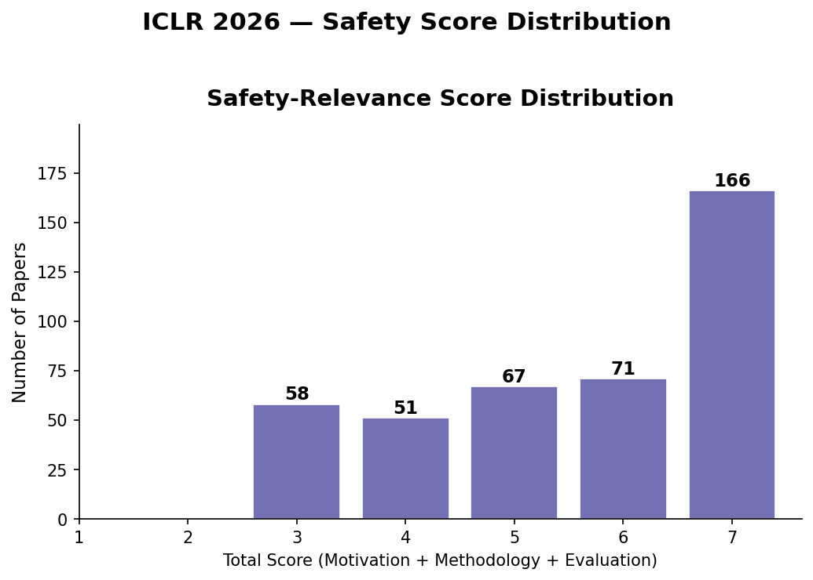

# AI Safety Research Tracker — ICLR / ICML / NeurIPS

Pipeline that pulls accepted papers from major ML conferences, classifies each into four high-level categories (Ethics & Fairness, Truthfulness & Reliability, General Capabilities, AI Safety) using DeepSeek V4 Flash with reasoning, and breaks the safety papers into 17 subdomains following a frontier-AI-safety-focused taxonomy.

## Latest: ICLR 2026

**412 out of 5,352 papers (7.7%) classified as AI Safety.**



### Safety score distribution



## Pipeline

```bash
# 1. Fetch accepted papers from OpenReview
python src/fetch.py iclr 2026

# 2. Classify them with the LLM (uses OPENROUTER_API_KEY)
python src/classify.py iclr 2026

# 3. Generate plots and filtered CSVs
python src/visualize.py iclr 2026
```

Each step writes under `data/{conference}/{year}/`:
```
data/iclr/2026/
├── papers.csv              # output of fetch
├── results.csv             # output of classify
├── plots/
│   ├── overview.png
│   ├── major_classes.png
│   ├── safety_subareas.png
│   ├── detailed_classes.png
│   └── score_distribution.png
└── filtered/
    ├── safety.csv          # 412 safety papers (title, subarea, class, score)
    ├── ethics_fairness.csv
    └── truthfulness_reliability.csv
```

Classification prompt lives in [src/prompt.txt](src/prompt.txt). Methodology iterations and prior runs are archived in `runs/`.

## Supported conferences

The fetcher handles ICLR, ICML, and NeurIPS via OpenReview's v1 and v2 APIs:

| Conference | Years | Source |
|---|---|---|
| ICLR | 2020–2026 | OpenReview |
| ICML | 2023–2025 | OpenReview |
| ICML | 2020–2022 | PMLR (not yet implemented) |
| NeurIPS | 2021–2025 | OpenReview |
| NeurIPS | 2020 | papers.nips.cc (not yet implemented) |

Years where the conference uses a different system fall back to alternate sources — see `ALT_SOURCES` in [src/fetch.py](src/fetch.py).

## Repo layout

```
.
├── src/
│   ├── fetch.py            # multi-conference paper fetcher
│   ├── classify.py         # LLM classifier with async parallel inference
│   ├── visualize.py        # plot + filtered-CSV generator
│   └── prompt.txt          # classification rubric
├── data/
│   └── iclr/2026/...       # per-conference, per-year datasets
├── runs/                   # archived methodology iterations
│   ├── v1/                 #   Gemma 4 31B + original prompt
│   ├── v2/                 #   Gemma 4 31B + refined prompt
│   └── v3_sample/          #   DeepSeek V4 Flash + reasoning, 1/4 sample
└── README.md
```
